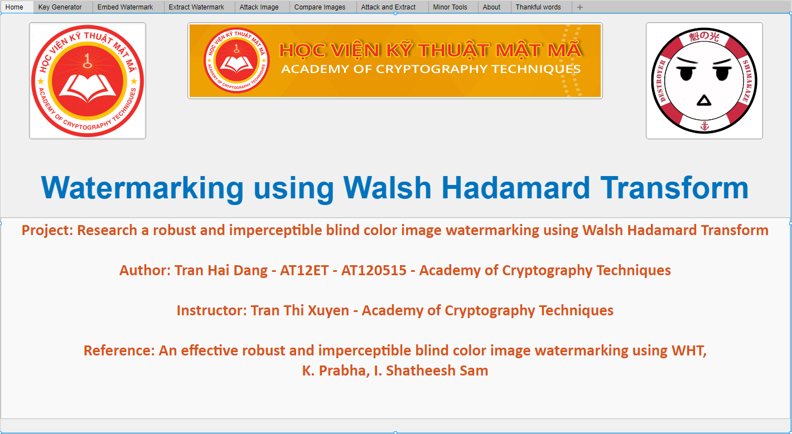

# Research a robust and imperceptible blind color image watermarking using Walsh Hadamard Transform
# Table of contents
* [1. Project Information](#1)
* [2. Overview](#2)
* [3. System information](#3)
* [4. How to use](#4)
* [5. How to install](#5)  
* [6. Embed Result](#6)  
* [7. Attack Result](#7)  
* [8. Note](#8)  

# Project information
Scholar: Tran Hai Dang    		
Class: AT12ET - AT120515    
Instructor: Ths. Tran Thi Xuyen  
Academy: Academy of Cryptography Techniques  
Project: Research a robust and imperceptible blind color image watermarking using Walsh Hadamard Transform  
Reference: An effective robust and imperceptible blind color image watermarking using WHT, K. Prabha, I. Shatheesh Sam  

# Overview
  

# System information

CPU: Intel Core I7-3770 3.4GHZ  
RAM: 16GB  
VGA: NVIDIA GeForce 650Ti  
Software: Matlab R2018a  
OS: Windows 10 build 19041
Display: Asus VA24EHE

# How to install  

** Go to [Release](https://github.com/haidang10897/Research-a-robust-and-imperceptible-blind-color-image-watermarking-using-Walsh-Hadamard-Transform/releases/tag/v1.0) to download**  

### For MATLAB user

    1. Download "WatermarkWHT_for_MATLAB_user" lastest version.
    2. Open "MATLAB" program.
    3. Change Workspace/Current folder to where you save the downloaded file above.
    4. Right-click to the ~.mlappinstall file to install.
    5. On top of the MATLAB menu, change to tab "Apps" and choose the program you've just installed.  

### For non-MATLAB user

    1. Download "WatermarkWHT" lastest version.
    2. Open the install file to install the program.
    3. Follow the instruction in the setup file.
    4. When done, open the program and begin to use.

### For Developer

    1. Clone or Fork,... the repository (E.g: Click Code -> Download ZIP on above menu of this web)
    2. Open "MATLAB" program.
    3. Change Workspace or add to path the folder you've just downloaded.
    4. Begin edit.

# How to use
> The program have GUI so it's very easy to use, if you still not know how to use, so go to the tab "About" in the program you've opened and read the guide. Beside, there are videos below the guide to help you (but require internet). - BacDau

> Tutorial videos: https://www.youtube.com/playlist?list=PL5D4ygJQLkjgtDO9FgI8tZhbU6i3DRSIl  

# Embed Result
| Host image | Watermark image |
|--|--|
|    |  |  

| Embedded host image | Extracted watermark image |
|--|--|
|  |  |

# Attack Result
| Attack | Extracted Watermark |
|--|--|
| Rotate |  |
| Resize |  |
| Crop Vertically |  |
| Salt and Pepper |  |
| Median filter |  |
| Brighten |  |
| Darken |  |
| Compress |  |

# Note
- Make sure to read the guide before using.
- If you're a developer, or just want to edit code, make sure you have MATLAB R2018 or newer, because "App designer" only have in that MATLAB version.

